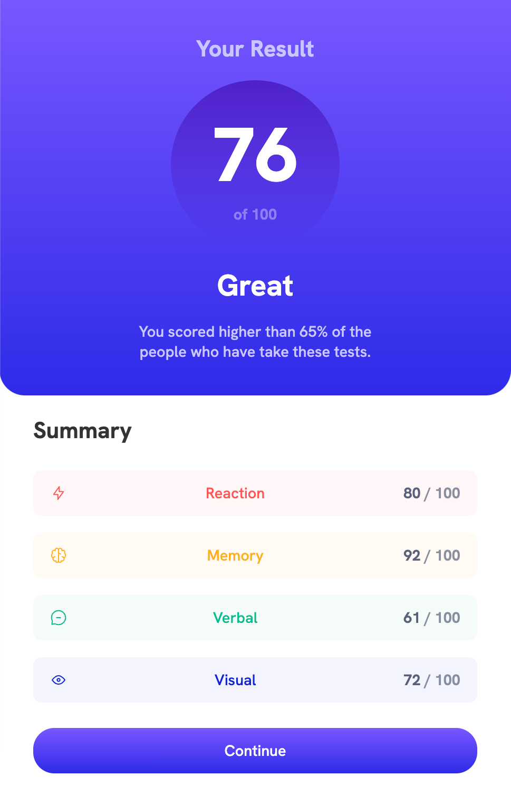
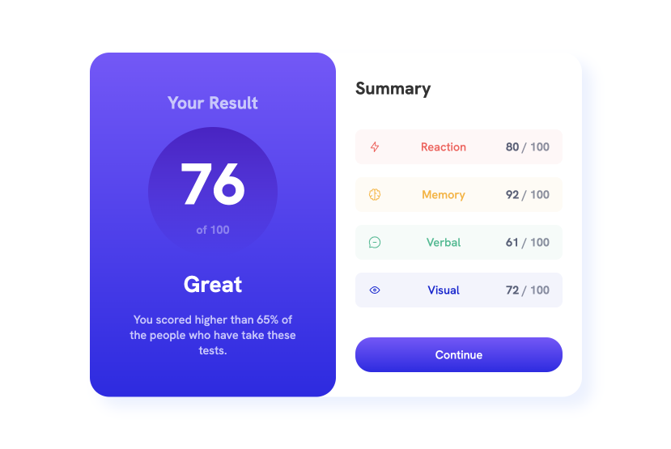

# Frontend Mentor - Results Summary Component Solution

## Overview of Challenge

### Users should be able to:

- View the optimal layout for the interface depending on their device's screen size
- See hover and focus states for interactive elements on the page

### Screenshot

Mobile View

Desktop View

### Links

- Live Site URL: [GitHub Pages](https://rsteckline.github.io/summary-component-FEM/)

### Built with

- CSS and Flexbox
- Semantic HTML

### What I learned

- Continued to enhance my Flexbox expertise and improve clarity in naming conventions.

### Useful resources

- [Turing Lesson](https://frontend.turing.edu/lessons/module-1/css-flexbox.html)
- [Flexbox Crash Course by Traversy Media](https://www.youtube.com/watch?v=3YW65K6LcIA)

## Author

[Bobby Steckline](https://www.github.com/rsteckline)

This is a solution to the Results summary component challenge on Frontend Mentor. [Source](https://www.frontendmentor.io/challenges/results-summary-component-CE_K6s0maV)